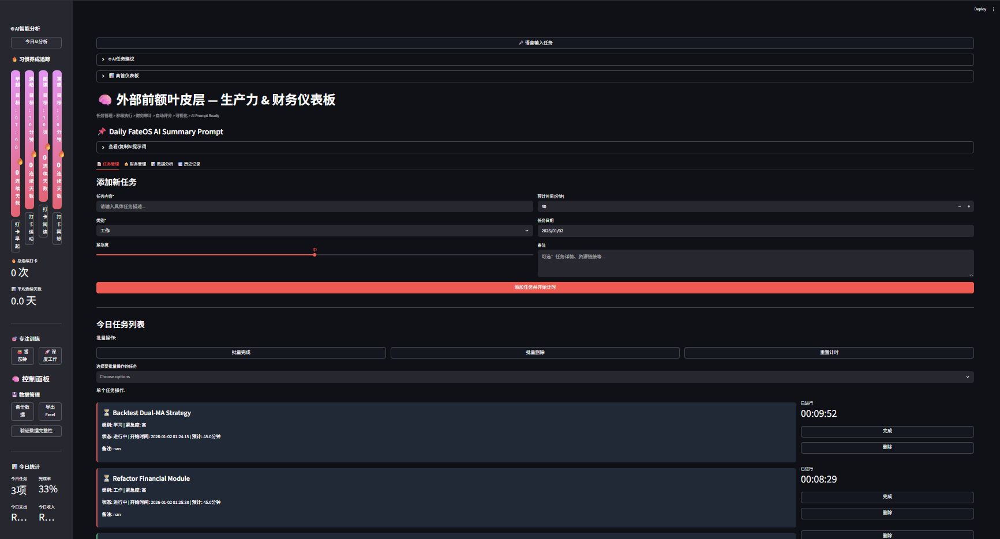

# 📈 Life-Quant-Dashboard


> **"Applying quantitative strategies to personal resource management: A Streamlit-based dashboard to track Asset Allocation, Cash Flow, and Execution Metrics."**

---

## 📖 Overview

**Life-Quant-Dashboard** is a personal analytics platform built with **Python** and **Streamlit**.


> *Live Demo: Tracking execution metrics and visualizing asset flow in real-time.*

As a data enthusiast, I realized that traditional productivity tools lack the "analytical" depth required for optimizing personal performance. This project bridges that gap by treating time and money as manageable assets. It visualizes personal liquidity, tracks asset accumulation, and quantifies daily task execution rates—effectively functioning as a **Personal ERP (Enterprise Resource Planning) System**.

---

## 🚀 Key Modules

### 1. ⚡ Execution Metrics (Task Quant)
* **Atomic Task Breakdown:** Breaks down high-level goals into granular, executable units to minimize friction.
* **Completion Rate Tracking:** Visualizes daily productivity output to identify behavioral patterns.
* **Status Analytics:** Categorizes tasks by urgency and status (Pending/Done) for better time-series analysis.

### 2. 🏰 Asset Allocation (Financial Quant)
* **Capital Flow Visualization:** Interactive **Plotly** charts tracking Income vs. Burn Rate.
* **Net Worth Monitor:** Shifts focus from "Transactional Spending" to "Asset Accumulation" (Balance Sheet approach).
* **Liquidity Tracking:** Monitors cash reserves against investment positions.

### 3. 📊 Data Intelligence
* **Time-Series Analysis:** Built-in historical data log to analyze spending trends over weeks/months.
* **Category Filtering:** Granular filtering capabilities using `pandas` to isolate specific spending sectors (e.g., Fixed Costs vs. Discretionary).

---

## 🛠️ Tech Stack

* **Frontend:** [Streamlit](https://streamlit.io/) (Rapid interactive dashboarding)
* **Data Processing:** [Pandas](https://pandas.pydata.org/) & [NumPy](https://numpy.org/)
* **Visualization:** [Plotly Express](https://plotly.com/python/) (Interactive financial charting)
* **Persistence:** JSON/CSV based local storage (Prototype phase)

---

## 💻 How to Run Locally

1.  **Clone the repository**
    ```bash
    git clone [https://github.com/YourUsername/Life-Quant-Dashboard.git](https://github.com/YourUsername/Life-Quant-Dashboard.git)
    cd Life-Quant-Dashboard
    ```

2.  **Install dependencies**
    ```bash
    pip install streamlit pandas plotly
    ```

3.  **Launch the dashboard**
    ```bash
    streamlit run appds.py
    ```

---

## 📸 Dashboard Screenshots

### 1. Macro View (Control Center)

> *Real-time visualization of executive function and asset summary.*

### 2. Financial Analytics (Quant Data)

> *Interactive Plotly charts tracking capital flow and expenditure categories.*

---

## 🧠 The Logic Behind

The philosophy behind this dashboard is simple: **"If you can't measure it, you can't manage it."** By building this tool, I aimed to:
1.  **Externalize Decision Making:** Reduce cognitive load by having a central "Source of Truth."
2.  **Visual Feedback Loops:** Create immediate visual feedback for financial and behavioral decisions.
3.  **Python Proficiency:** Demonstrate the ability to build full-stack data applications, from data cleaning (Pandas) to visualization (Plotly) and deployment (Streamlit).

---

## 🤝 Contribution

This is a personal sandbox project. However, feel free to fork it and adapt the logic to your own life algorithms.